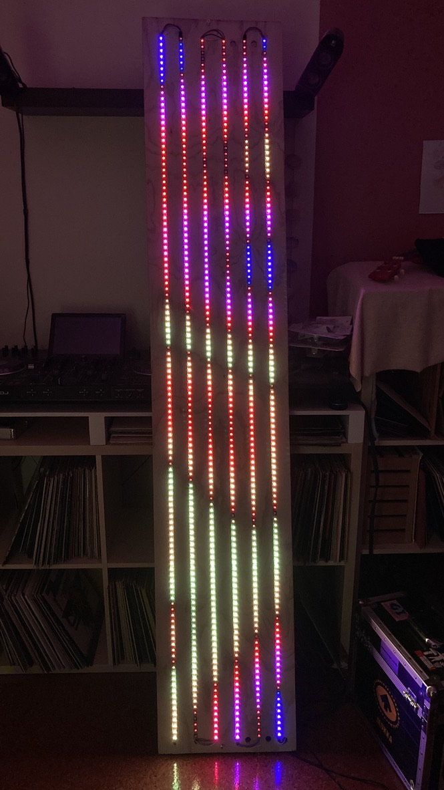
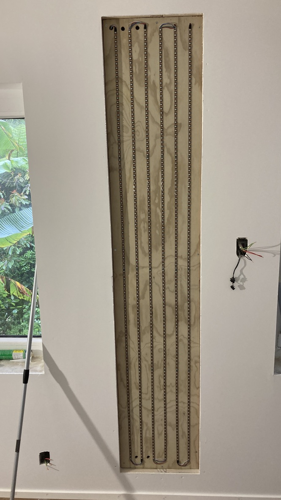
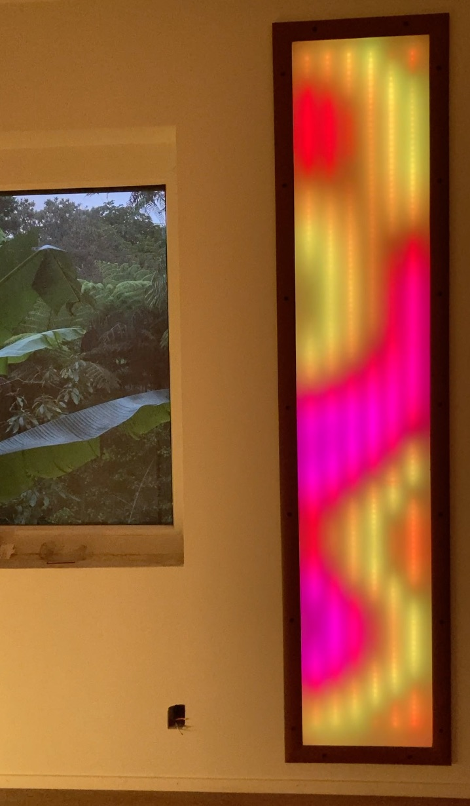
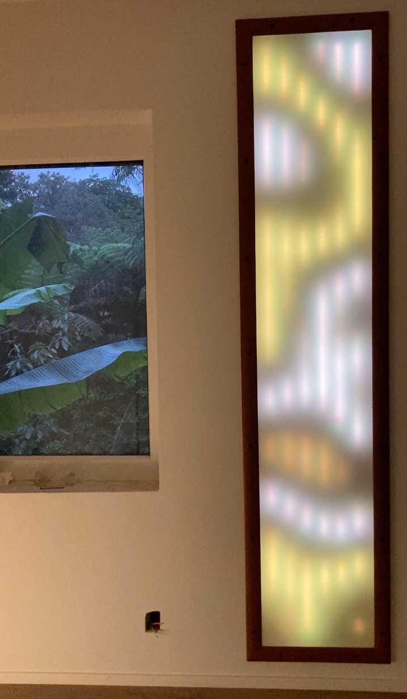
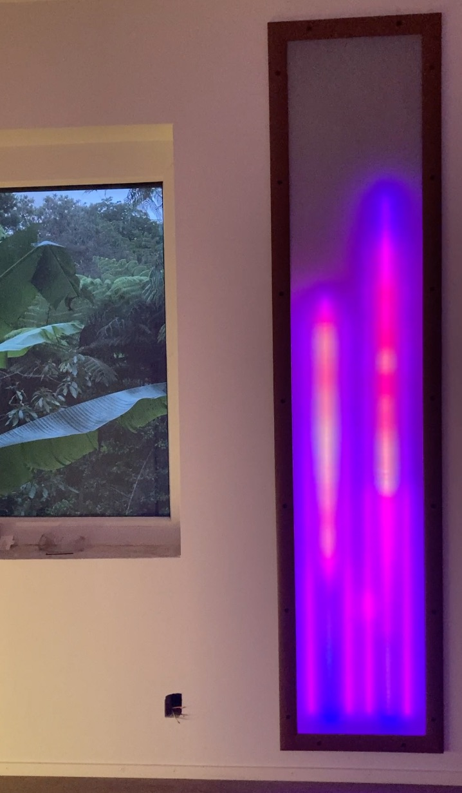

Simple LED Wallbox
==================

720 LEDs, arranged in 6 columns, controlled by an ESP32 (GPIO2)

Single button control (GPIO13) to switch programs (short push) or change brightness (long hold).

The code is ugly, but might be useful to someone.

